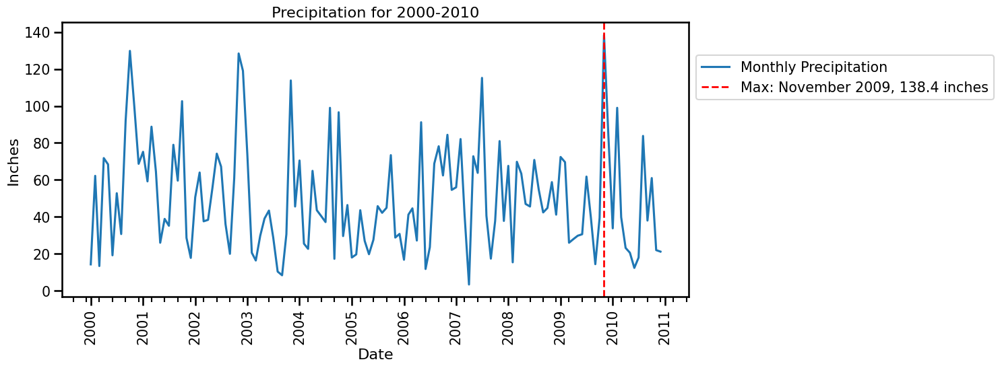
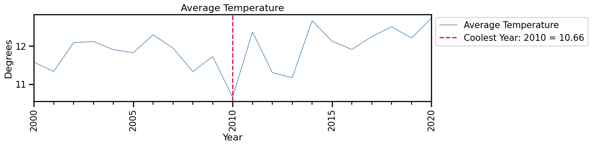

# Time Series Climate Analysis (1979–2020)

This project performs a complete time-series analysis on a historical climate dataset.  
It includes preprocessing, datetime conversion, resampling, imputation, and analytical visualizations using pandas and matplotlib.

The analysis answers two core questions:

1. **Which month between 2000–2010 had the most total precipitation?**  
2. **Which year between 2000–2020 had the lowest average temperature?**

Both answers are supported with correctly formatted time-series visuals.

---

## Dataset Description

Each row contains a daily climate observation with the following features:

- `date`  
- `cloud_cover`  
- `sunshine`  
- `global_radiation`  
- `max_temp`, `mean_temp`, `min_temp`  
- `precipitation`  
- `pressure`  
- `snow_depth`

Initial dataset range: **1979-01-01 → 2020-12-31**  
For this project, we filter to **2000 and later**.

---

## Project Steps

### 1. Load and Prepare the Data
- Convert `date` column to `datetime64` using a custom format (`%Y%m%d`).
- Set `date` as the index.
- Filter to rows from **2000 onward**.
- Keep only:
  - `precipitation`
  - `mean_temp`
  - `min_temp`
  - `max_temp`
  - `snow_depth`

### 2. Handle Missing Values
Different variables require different imputation strategies:

- Temperature columns → **interpolation**  
- Precipitation → **missing=0**
- Snow depth → **forward fill**, then **interpolate**
- Final verification using `.isna().sum()`

---

## Question 1  
### Which month between 2000–2010 had the most precipitation?

Method:
1. Resample to **monthly (MS)** frequency using `.sum()`.
2. Restrict to **2000–2010**.
3. Identify month with maximum precipitation via `.idxmax()`.
4. Plot the monthly totals with:
   - Major ticks every 1 year  
   - Minor ticks every 3 months  
   - Four-digit year labels  
   - A vertical dashed line marking the max month

### Q1 Visualization

---

## Question 2  
### Which year between 2000–2020 had the coolest average temperature?

Method:
1. Resample `mean_temp` to **yearly (A)** frequency using `.mean()`.
2. Identify the coolest year using `.idxmin()`.
3. Plot the yearly averages with:
   - Major ticks every 5 years  
   - Minor ticks every 1 year  
   - Rotated 90° year labels  
   - A vertical line marking the coolest year

### Q2 Visualization

